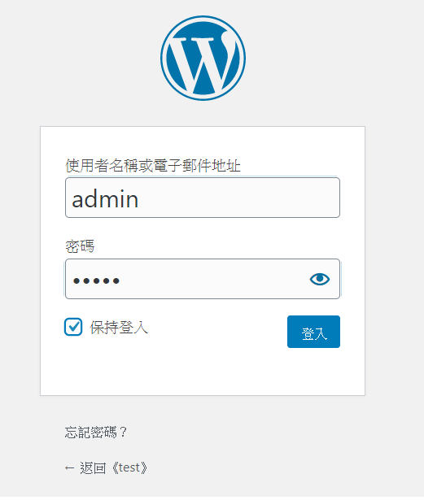

# Wordpress with Docker

- [Wordpress with Docker](#wordpress-with-docker)
  - [版本](#版本)
  - [前置條件](#前置條件)
  - [環境](#環境)
  - [Guide](#guide)
  - [啟動Wordpress](#啟動wordpress)
  - [安裝佈景主題或外掛](#安裝佈景主題或外掛)
  - [安裝UpdraftPlus](#安裝updraftplus)
  - [驗證備份資料](#驗證備份資料)


版本
---
- ver.1
   - docker-compose.yaml
      - mysql
      - phpmyadmin
      - wordpress
- ver.2
   - wordpress/docker-compose.yaml
      - mysql
      - wordpress
      - `nginx`
      - certbot(可選)


前置條件
---
1. 安裝python
2. 安裝docker、docker-compose

環境
---
1. Windows 10 Home 
2. Docker desktop

Guide
---
1. 啟動docker-compose, 把wordpress run起來
2. 設定好網站資料和安裝主題、外掛
3. 安裝備份插件UpdraftPlus
4. 一鍵備份網站
5. 驗證備份資料


啟動Wordpress
---

1. clone this repo
   ```bash
   $ git clone https://github.com/a607ernie/docker_wordpress.git
   ```
2. cd to this folder
   ```bash
   $ cd docker_wordpress
   ```
3. ```$ docker-compose up -d```
4. 在瀏覽器上輸入```localhost:8000```即可到安裝畫面(大概需要10秒~30秒啟動)


5. 跟著提示填上資料


6. 到這邊安裝結束


7. 登入wordpress



安裝佈景主題或外掛
---
為了等等還原時知道有沒有成功，因此先來改變一下wordpress的外觀

1. 安裝```OnePress```佈景主題並啟用(可自行選擇，但匯入示範資料這邊不確定其他主題有沒有支援)


2. 因為這個主題有自帶範例頁面，因此先去安裝所需要的外掛和設定初始頁面


3. 照著```建議操作```去安裝所需要的外掛和設定靜態頁面後


也要```匯入示範資料```


完成後應該可以在```http://localhost:8000/```看到全新的wordpress

4. 寫一篇新文章並發佈


安裝UpdraftPlus
---

1.  在外掛頁面上搜尋```UpdraftPlus```並安裝


2.  選擇```一鍵備份```


3.  如果沒有選擇放在雲端空間，那備份資料就會在```wpsite/wp-content/updraft```


驗證備份資料
---

1. 把```wpsite/wp-content/updraft```和 ```wpsite/wp-content/plugins/updraftplus```整個資料夾複製出來
2. 把wordpress關掉，```移除wpsite資料夾```並用```-v```刪除volume.
```bash
$ docker-compose down -v
```
3. 重新建立一個新的wordpress
```bash
$ docker-compose up -d
```
4. 一樣的方法去設定wordpress，完成後到主控台
5. 把```updraftplus```複製到```wpsite/wp-content/plugins/updraftplus```，並回主控台去啟用
6. 把剛剛複製出來的```updraft```資料夾底下的五個壓縮檔放到```wpsite/wp-content/updraft```裡面
7. 到updraftplus設定頁面，可以看到已經建立好的備份檔
8. 按下```還原```


9. 還原成功後，去看```全部文章```，可以看到文章有還原回來


10. 到```localhost:8000```看網站，還原成功


--完--